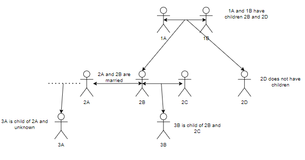
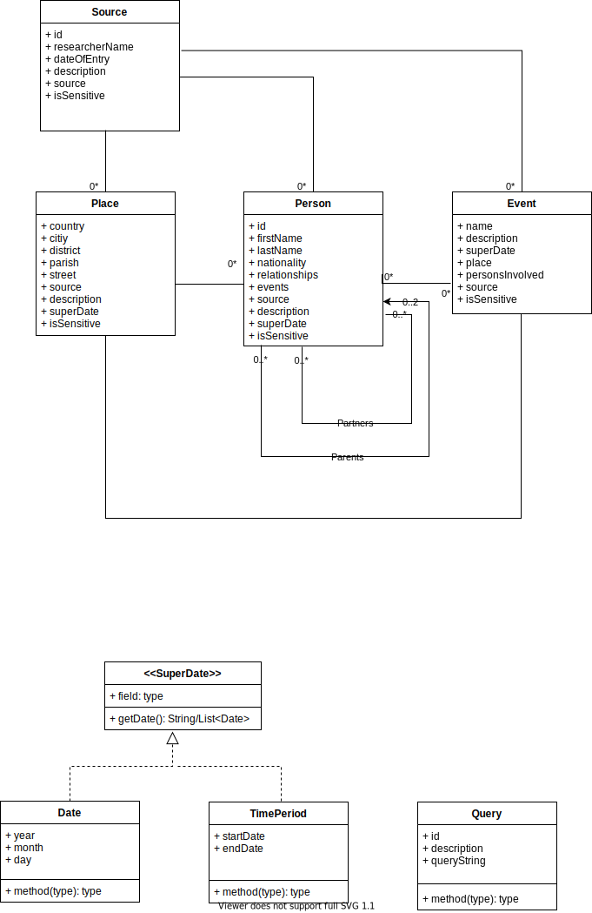
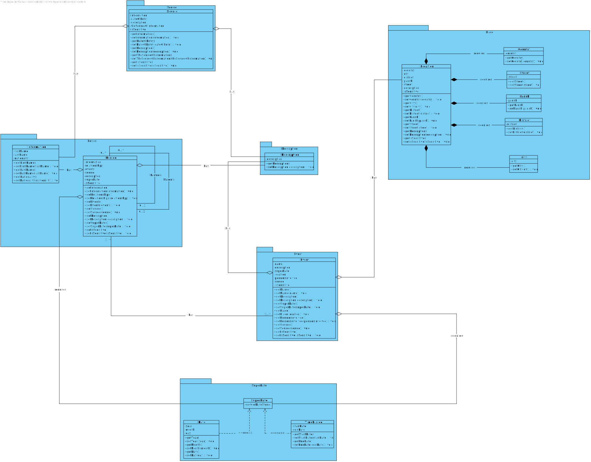
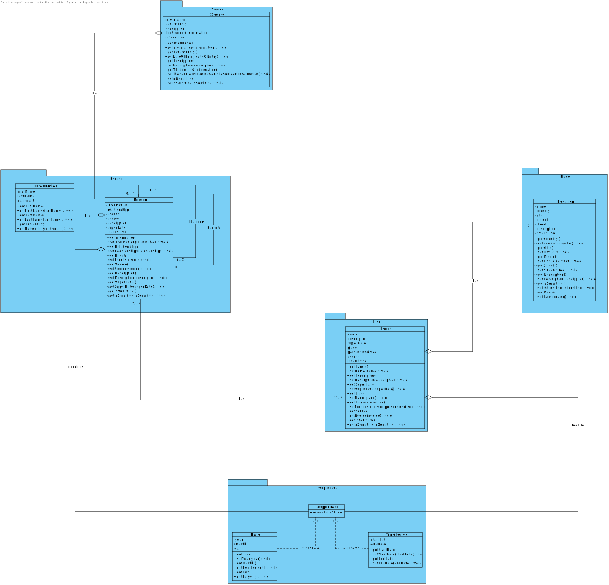
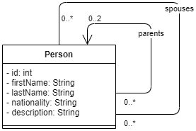
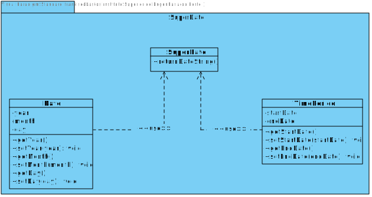

# HighestTree

## Table of Contents

- [1. Introduction](#introduction)
    - [1.1 Problem description](#problem_description)
- [2. Goals](#goals)
- [3. Design](#design)
    - [3. 1. Domain](#design)
        - [3. 1. 1. First approach](#first_approach)
        - [3. 1. 2. Refactor and code smells](#refactor_and_code_smells)
        - [3. 1. 3. Second approach](#second_approach)
    - [3. 2. Patterns](#patterns)
        - [Persons and their Relationships to another](#persons)
        - [Date, time periods and super dates](#dates)
        - [Model-View-Controller (MVC)](#mvc)
        - [Model-View-Controller-Service (MVCS), data access objects (DAOs) and data transfer objects (DTOs)](#mvcs)
        - [Granularity of the fields](#granularity)
        - [Granularity of the fields](#composite)

## How to run the project

HighestTree project can be executed on IntelliJ IDEA built-in tools or called using the command line. At start-up, a home screen menu is displayed where the user can browse through the system capabilities. If there is any problem
opening or running the project, don't hesitate to contact us. To run properly, it’s essential to import all the required maven dependencies.

## Requirements

[Link to requirements google docs](https://docs.google.com/spreadsheets/d/1xZ9EhlMW8qUNATcF684Nj9N8olOkkjLRqoa5ysPpLKs/edit?usp=sharing)

## 1. Introduction<div id="introduction"></div>

The project intent is to develop a solution that helps historians study the "who," "what," and "when" genealogy tree. The product aims to help with genealogy research plans by providing a method to trace the birth, marriage, and death records of individuals and their relationships with other individuals, places, and events.

### 1.1 Problem description <div id="problem_description"></div>

Genealogy is a long-term research goal with built-in short-term steps. Its main spotlights are the individuals and their background in time and geography. It's a research objective where the user can add more information while maintaining the links between individuals, places, and events.

The team views on the model could is a representation of the relationship between two (or more) persons in two ways: horizontally, as in married, or had children with; and vertically as in "child of," "parent to," "adopted by". A brief example of the type of ramifications that can occur is presented in the following image.



A problem that can occur in the usage of the model is data redundancy, primarily when adding relationships between two (or more people), or when creating a place
and even when creating events. In our project, we tried to address this in the implementation, as described in the design section. 

A challenge that was identified beforehand is related to the “date” field. A record (person or event) can have a known specific date, or the user can only have a reference for a generic period. For example, we might know our exact birth date, however, I’ts unknown precisely when Humanity invented the wheel. Historians only know that it was in the 4th century BC and that qualifies as a period. A user might know that his great-grandmother was born in the 19th century, however, he knows for sure that his mother was born on the 3rd of December,1969. Our system should be able to record either specific dates or periods, as requested in the requirements listed below. 

One other trial that will be faced is that the locations information might be incomplete. For example, the user doesn't know where a specific person relative from Italy natal city is, only that he or she is from Italy. When creating Locations, Events or Persons, every object in our model, should allow this option to insert information in a granular manner. 


## 2. Goals<a name="goals"></a>

This exercise was presented as a series of bullet points of features or ideas for the system under development. These
were broken down into the following requirements.

**SReq_01**    The system can record and display persons.

**SReq_02**    The system can record and display events.

**SReq_03**    The system can record and display places.

~~**SReq_04**    The system can record types of relationships.~~

**SReq_05**    The individual records "person" are interrelated between themselves through "relationships".

**SReq_06**    When recording a new individual through the user interface, the system pre-fills fields that it can
infer.

**SReq_07**    The system can record types of events.

**SReq_08**    Events can have a special purpose field that is specific to their individual nature.

**SReq_09**    Events can have a connection to a location.

**SReq_10**    The place's entry have different levels of granularity (Only Country, City, District, Parish... or a
combination of some).

**SReq_11**    System can insert dates onto records as a time period or a specific date.

**SReq_12**    The Date entry (time period or specific date) can be partially filled, e.g, only the year and month are
known.

**SReq_13**    Individuals, events, and places are described by the researchers in free text.

**SReq_14**    Individuals, events, places ~~and relationships~~ can have an additional field specifying where each
piece of information was acquired.

**SReq_15**    The system is able to query existing individuals by filtering information using rules based on each of
the available fields and relationships.

**SReq_16**    The system can save queries to be reused.

**SReq_17**    The system is able to export the information gathered from a query.

**SReq_18**    The system is able to save the information gathered from a query.

**SReq_19**    The system is able to load and save records using different formats.

**SReq_20**    It is possible to add different export formats to the system.

**SReq_21**    The system can export the genealogy information to formats that allow a graphical visualization (such as
the DOT language (graphviz)).

**SReq_22**    Any field in a record can be set as sensitive information, and decide when exporting if sensitive
information should be part of the output or not.

**SReq_23**    When exporting, the system as a choice to output, or not, fields marked as sensitive information.

**SReq_24**    System can be used in view-only mode.

**SReq_25**    System can be used in edit-mode.

## 3. Design<a name="design"></a>

This section exposes the design decisions made during the ongoing phases of development of this project.

### 3.1. Domain<a name="domain"></a>

#### 3.1.1 First approach<a name="first_approach"></a>

As a first step into the solution, the group modeled the classes in a database manner, while discussing the
implementation, kinds of relationships, and possible patterns that could be applied.

Additionally, some time was spent thinking about the solution to SReq_11 "System can insert dates onto records as a time
period or a specific date." The solution that was devised was a superClass that can take two dates as parameters, but
the user can insert only one date if the specific date is known. For a time period, the user can add two partial, or
complete, dates.

In this phase, the group also discussed options to store queries for SReq_16 "The system can save queries to be reused."
As a simple solution, a specific classes for storing and calling query strings.

As a result one can see the main components of our system as described in the image below.



### 3.1.2 Refactor and code smells<a name="refactor_and_code_smells"></a>

As the good practices say, we should write code and then refactor it. We found several codes smells. A PowerPoint
presentation regarding them can be accessed throw
this [link](https://docs.google.com/presentation/d/1SnStiRzLfbJ_3eKdzlC02kBM3T-gWlUZPRKwiSLjrH4/edit#slide=id.gfc000407e6_0_27)
.

### 3.1.3 Second approach<a name="second_approach"></a>

After refactoring the code to solve the code smells, we developed our model's second iteration (and third iteration). On
the consequence iterations, we tried to solve the primitive obsession, long parameter list, and the redundancy that
our (original model had) and that we constantly used across our model classes. We tried to divide the attributes (for
example) in the package "Place" in the class "Location" we split the several attributes into several objects like "
Country," "Street," and others. We were solving the primitive obsession and resolving a redundancy issue. However, some
connections between classes (the multiplicity) did not justify the effort of creating an extra object to model the
object. So we iterate to the third iteration of our model, where we tried even further to remove redundancies between
classes (as it can be seen again in the Place package). Another thing that we modeled was the iteration between Person
and Events. The second iteration implemented an intermediate object representing the connection between those two core
classes. However, we could replace the additional effort (creating that object) with a relationship between them and a
multiplicity of one to many. The third iteration removes the "extra effort" of creating objects to simplify our model (
the KISS rule).

* **Diagram second iteration:**



* **Diagram third iteration:**



### 3.2. Patterns<a name="patterns"></a>

This section presents the study of the design patterns considered for this project.

The group first started by looking at the system's requirements versus the patterns given in class. Having identified
some patterns that might be useful for the case in study, we proceeded to investigate further on the mentioned patterns.

In this round of implementation, group B elected several problems for the use of design patterns. The group focused
mainly on the relationship tree between 'person' records. Several design patterns were studied and discussed. It has yet
to be identified the correct approach.

For the eventual patterns used in this project, the group shall include detailed descriptions of the problems,
implementation and consequences were whirling the use of the same.

### Persons and their Relationships to another<a name="persons"></a>

* **Problem:** Design the Person-Relationships without redundancies
* **classes:** [Person.java](src/main/java/mesw/ads/highesttree/HighestTree/model/Person.java)
* **Solution:** Each Person Object is associated to its parents and its spouses.
* **Consequences:**
    * The Family Tree is easy to traverse bottom-up (get the ancestors of a person) but more difficult to traverse
      top-down (get the children of a person), because a person only knows about its parents but not its children.
* **Implementation:** In the code snippet bellow you can observe a method that allows to get all the accessors of a
  person, the same logic can be applied to the partners (spouses, boyfriend, etc...) of the person.
  ```java
  public class Person {
  private int id;
  private String firstName;
  private String lastName;
  private String nationality;
  private LinkedList<Event> events;
  private Source source;
  private String description;
  private LinkedList<Person> parents;
  private LinkedList<Person> partner;
  private boolean sensitive;

  // standard constructors and getters and setters.

    public static LinkedList<Person> getAncestors(Person targetPerson, LinkedList<Person> ancestors) {
        if (targetPerson.getParents() != null) { 
            for (Person parent : targetPerson.getParents()) { 
                ancestors.add(parent);
                ancestors = getAncestors(parent, ancestors); 
            } 
        } 
      return ancestors; 
    }
  // other methods of the class.
  }
  ```

* **Diagram:**

  

### Date, time periods and super dates<a name="dates"></a>

* **Problem:** A person can be born on a specific date or in on a time period. For example, an individual could be born
  in 1578 or in the XVI century (between 1501 and 1600).
* **Classes:** [Date.java](src/main/java/mesw/ads/highesttree/HighestTree/model/Date.java)
  , [SuperDate.java](src/main/java/mesw/ads/highesttree/HighestTree/model/SuperDate.java)
  and [TimePeriod.java](src/main/java/mesw/ads/highesttree/HighestTree/model/TimePeriod.java)
* **Solution:**
    * There is an interface called SuperDate and two classes called Date and TimePeriod. Those classes implement
      SuperDate and when creating an object that requires a date (for example an Event) it is possible to create a date
      or a time period.
        * This solution implements the [*template method*](https://refactoring.guru/design-patterns/template-method)
          pattern by breaking down the date-time period logic into a series of two steps, and turning these steps into a
          method and then call those methods inside a single template method.
* **Problems:**
    * One of the problems that we can encounter is the violation of the Liskov Substitution Principle by suppressing a
      default step implementation via a subclass and the maintainability of the code. If any changes to the method need
      to be made, it can get harder to maintain the more differences there are.
* **Implementation:** In the code snippet bellow you can observe the SuperDate interface that exposes
  a ```returnDateString();``` method that forces the Date.java and TimePeriod.java classes to return or a date or of a
  time period.

    ```java 
    public interface SuperDate {
        String returnDateString();
    }
    
    public class TimePeriod implements SuperDate {
        // standard methods.
        
        @Override
        public String returnDateString() {
            return toString();
        }
    }
    
    public class Date implements SuperDate {
        // standard methods.
        
        @Override
        public String returnDateString() {
            return toString();
        }
    }
    ```


* **Diagram:**

  

### Model-View-Controller (MVC)<a name="mvc"></a>

* **Problem:** We need to have a constantly evolving graphical user interface so the user can preform the CRUD
  operations, as well as interact with our system.
* **Solution:**
    * The MVC divides an interactive application into three parts. The model contains the core functionality and data (
      all of the classes in the model package). Views display information to the user (the FXML resources). The
      controllers handle user input (the controller's package). Views and controllers together comprise the user
      interface.
        * Another concern is the fact that GUI is constantly being improved/changed. However, changes to a user
          interface must not affect an application's core functionality, which is generally independent of its
          presentation and changes less frequently. A change-propagation mechanism ensures consistency between the user
          interface and the model.
    * The solution divides the interactive application into three decoupled parts: processing, input, and output. Ensure
      the consistency of the three parts with the help of a change propagation mechanism.
* **Problems:** The most significant problems consist in the increased complexity (if you have 1 model class, you need
  to create two more classes...in our system for six classes, we need to make 12 more classes minimum), and a
  potentially excessive number of updates. If I change one model behavior, I might have to change more than one class,
  which happens because of the intimate connection between views and controllers (close coupling of views and
  controllers to the model and between them).
* **Implementation and classes:** The [Place](src/main/java/mesw/ads/highesttree/HighestTree/model/place/Location.java)
  in the model, the [Place](src/main/java/mesw/ads/highesttree/HighestTree/controller/location/LocationController.java)
  in the controller, and the [FXML](src/main/resources/fxml/displayPlaces.fxml) files that connect to the controller.

    ````java
    public class Location {
        private int id;
        private String name;
        private String country;
        private String district;
        private String city;
        private String street;
        private String description;
        private boolean isSensitive;
    
        // standard methods and getter and setters.
    }
    
    public class LocationController implements Initializable {
    
        @FXML
        private TextField placeName_txt;
        @FXML
        private TextField country_txt;
        @FXML
        private TextField district_txt;
        @FXML
        private TextArea descriptionTextArea;
        @FXML
        private TextField city_txt;
        @FXML
        private TextField street_txt;
        @FXML
        private ChoiceBox<String> sensitiveInformation_optn;
    
        private void changeScene(String SceneName, ActionEvent event) throws IOException {
            // A method to change the scenes in the project.
        }
    
        private void fillComboBox() {
            // auxiliary method to fill the combo box.
        }
    
        /**
         * Called to initialize a controller after its root element has been
         * completely processed.
         *
         * @param location  The location used to resolve relative paths for the root object, or
         *                  <tt>null</tt> if the location is not known.
         * @param resources The resources used to localize the root object, or <tt>null</tt> if
         */
        @Override
        public void initialize(URL location, ResourceBundle resources) {
            // Initialization method.
        }
    
        private boolean setSensitivity(String sensitivity) {
            // Auxiliary method.
        }
    
        public void actionRegisterPlaceBtn(ActionEvent actionEvent) throws IOException {
            // Button click handler.
        }
    
        public void actionGoBackBtn(ActionEvent actionEvent) throws IOException {
            // Button click handler.
        }
    
        public void actionViewPlaces(ActionEvent actionEvent) throws IOException {
            // Button click handler.
        }
    }
    ````

  ```XML
  <?xml version="1.0" encoding="UTF-8"?>
    
    <!--the view-->
    
    <?import javafx.scene.control.Button?>
    <?import javafx.scene.control.TextArea?>
    <?import javafx.scene.layout.AnchorPane?>
    <?import javafx.scene.text.*?>
    <!--the connection to the controller-->
    <AnchorPane xmlns:fx="http://javafx.com/fxml/1" maxHeight="-Infinity" maxWidth="-Infinity" minHeight="-Infinity"
                minWidth="-Infinity" prefHeight="390.0" prefWidth="490.0" style="-fx-background-color: #2A363F;"
                xmlns="http://javafx.com/javafx/17"
                fx:controller="mesw.ads.highesttree.HighestTree.controller.database.ReaderController">
    
        <!--the file continues-->
  </AnchorPane>
  ```

### Model-View-Controller-Service (MVCS), data access objects (DAOs) and data transfer objects (DTOs)<a name="mvcs"></a>

* **Problem:** In order to display users, places, events, ... we need to write and reed to something that can hold
  data (a database, and Excel file or text files).
* **Solution:**
    * We are adding another layer to the MVC model, a service. The service layer is an abstraction over domain logic. It
      defines the application's boundary with a layer of services that establishes a set of available operations and
      coordinates the application's response in each process. The service layer is an architectural pattern applied
      within the service-orientation design paradigm, which aims to organize the services, within a service inventory,
      into a set of logical layers. Services categorized into a particular layer share functionality; it helps reduce
      the conceptual overhead related to managing the service inventory, as the services belonging to the same layer
      address a smaller set of activities.
    * We need to create DTOs and DAOs to implement this pattern correctly.
        * DTO is an abbreviation for Data Transfer Object, so it is used to transfer the data between classes and
          modules of your application.
        * DAO is an abbreviation for Data Access Object, so it should encapsulate the logic for retrieving, saving, and
          updating data in your data storage (a database, a file system, whatever).
* **Problems:** They are the same as the MVC, they basically consist in added complexity, and they might lead to loss in
  performance and close coupling between the different modules.
* **Implementation and classes:**
  the [LocationController.java](src/main/java/mesw/ads/highesttree/HighestTree/controller/location/LocationController.java)
  , [LocationService.java](src/main/java/mesw/ads/highesttree/HighestTree/service/LocationService.java), the
  [DaoLocation.java](src/main/java/mesw/ads/highesttree/HighestTree/model/dao/location/DaoLocation.java) and the Dao
  interface, as well as the [Reader](src/main/java/mesw/ads/highesttree/HighestTree/model/database/Reader.java)
  and [Writer](src/main/java/mesw/ads/highesttree/HighestTree/model/database/Writer.java) classes, and the
  [ReaderController.java](src/main/java/mesw/ads/highesttree/HighestTree/controller/database/ReaderController.java)
  class.

````java
public class LocationService {
    private static Dao<Location> locationDao = new DaoLocation();
    private static Location location;

    public static void save(String name,
                            String country,
                            String district,
                            String city,
                            String street,
                            String description,
                            boolean isSensitive) {
        location = new Location(name, country, district, city, street, description);
        location.setSensitive(isSensitive);
        locationDao.save(location);
        // Register user on the file database
        Writer.writeToFile("files/location.txt", location.toString());
    }

    public static Collection<Location> getAllLocations() {
        return locationDao.getAll();
    }

    public static int saveLocation(Location location) {
        validate(location);
        return locationDao.save(location);
    }

    private static void validate(Location location) {
        // Not implemented
        if (location == null)
            throw new NullPointerException();
    }

    public static List<String> getAllLocationsFromFileDatabase() {
        // Reads user from file database
        return Reader.readFromFile("files/location.txt");
    }

    public Location getLocation() {
        return location;
    }
}

public class DaoLocation implements Dao<Location> {

    private List<Location> locationList = new LinkedList<>();

    @Override
    public Optional<Location> get(int id) {
        return Optional.ofNullable(locationList.get(id));
    }

    @Override
    public Collection<Location> getAll() {
        return locationList.stream()
                .filter(Objects::nonNull)
                .collect(Collectors.collectingAndThen(Collectors.toList(), Collections::unmodifiableList));
    }

    @Override
    public int save(Location location) {
        locationList.add(location);
        int index = locationList.size() - 1;
        location.setId(index);
        return index;
    }

    @Override
    public void update(Location location) {
        locationList.set(location.getId(), location);
    }

    @Override
    public void delete(Location location) {
        locationList.set(location.getId(), null);
    }
}

public interface Dao<T> {

    Optional<T> get(int id);

    Collection<T> getAll();

    int save(T t);

    void update(T t);

    void delete(T t);
}

public class LocationController implements Initializable {

    // attributes and methods

    public void actionRegisterPlaceBtn(ActionEvent actionEvent) throws IOException {
        try {
            String name = placeName_txt.getText();
            String country = country_txt.getText();
            String district = district_txt.getText();
            String city = city_txt.getText();
            String street = street_txt.getText();
            String description = descriptionTextArea.getText();
            String isSensitive = sensitiveInformation_optn.getSelectionModel().getSelectedItem();
            boolean sensitivity = this.setSensitivity(isSensitive);

            // Service saves location
            LocationService.save(name, country, district, city, street, description, sensitivity);

            this.changeScene("/fxml/displayPlaces.fxml", actionEvent);

        } catch (Exception e) {
            e.printStackTrace();
            this.changeScene(ERROR_SCREEN, actionEvent);
        }

    }

    // the class continues
}

public class ReaderController implements Initializable {

    // attributes and methods

    @Override
    public void initialize(URL url, ResourceBundle resourceBundle) {
        List<String> data = LocationService.getAllLocationsFromFileDatabase();
        for (String element : data) {
            placesTextArea.appendText(element);
            placesTextArea.appendText("\n");
        }
    }

    // the class continues
}
````

### Granularity of the fields<a name="granularity"></a>

* **Problem:** We might not know from the start, what are the fields of some objects. For example, "I might not know
  what is the name of the street, the district or the city where my great-great-grandfather was born; however, I know
  that he was born in England."
* **Solution:**
  Both on the model and on the service allow for the creation and editing the created objects.
* **Problems:** Close coupling of the different modules as well as, if the system it's not prepared some exceptions
  might be thrown, as well as an increase in complexity.
* **Implementation:**

```java
public class Location {
    private int id;
    private String name;
    private String country;
    private String district;
    private String city;
    private String street;
    private String description;
    private boolean isSensitive;

    public Location(String name,
                    String country,
                    String district,
                    String city,
                    String street,
                    String description) {
        setName(name);
        setCountry(country);
        setDistrict(district);
        setCity(city);
        setStreet(street);
        setDescription(description);
    }

    public String getName() {
        return name;
    }

    // It is mandatory for a place to have a name, a country and a description as well as a sensitive field. 
    // The implementation of the other obligatory field is similar to this one.
    public void setName(String name) {
        if (name == null || name.length() == 0)
            throw new IllegalArgumentException("The name attribute cannot be empty");
        else
            this.name = name;
    }

    public String getCountry() {
        return country;
    }

    public void setCountry(String country) {
        if (country == null || country.length() == 0)
            throw new IllegalArgumentException("The country attribute cannot be empty");
        else
            this.country = country;
    }

    public String getDistrict() {
        return district;
    }

    // the class continues
}

public class LocationService {
    private static Dao<Location> locationDao = new DaoLocation();
    private static Location location;

    public static void save(String name,
                            String country,
                            String district,
                            String city,
                            String street,
                            String description,
                            boolean isSensitive) {
        location = new Location(name, country, district, city, street, description);
        location.setSensitive(isSensitive);
        locationDao.save(location);
        // heavy logic done here
        // Register user on the file database
        Writer.writeToFile("files/location.txt", location.toString());
    }

    public static Collection<Location> getAllLocations() {
        return locationDao.getAll();
    }

    public static int saveLocation(Location location) {
        validate(location);
        return locationDao.save(location);
    }

    private static void validate(Location location) {
        // Not implemented
        if (location == null)
            throw new NullPointerException();
    }

    public static List<String> getAllLocationsFromFileDatabase() {
        // Reads user from file database
        return Reader.readFromFile("files/location.txt");
    }

    public Location getLocation() {
        return location;
    }
}

````
