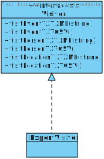

# HighestTree

## Table of Contents

- [1. Introduction](#introduction)
    - [1.1 Problem description](#problem_description)
- [2. Goals](#goals)
- [3. Design](#design)
    - [3. 1. Domain](#design)
        - [3. 1. 1. First approach](#first_approach)
        - [3. 1. 2. Refactor and code smells](#refactor_and_code_smells)
        - [3. 1. 3. Second approach](#second_approach)
    - [3. 2. Patterns](#patterns)
        - [Date, time periods and super dates](#dates)
        - [Model-View-Controller (MVC)](#mvc)
        - [Data access objects (DAOs) and data transfer objects (DTOs)](#dao_dto)
        - [Composite Pattern](#composite_pattern)
        - [Template Method](#template_method)
        - [Filter Pattern](#fileter_pattern)
        - [Visitor and strategy patterns to export files](#visitor_and_strategy)
        - [Persons and their Relationships to another](#persons)
    - [3. 3. Future works](#future_work)
  
## How to run the project

HighestTree project can be executed on IntelliJ IDEA built-in tools or called using the command line. At start-up, a
home screen menu is displayed where the user can browse through the system capabilities. If there is any problem opening
or running the project, don't hesitate to contact us. To run properly, it’s essential to import all the required maven
dependencies.

## Requirements

[Link to requirements google docs](https://docs.google.com/spreadsheets/d/1xZ9EhlMW8qUNATcF684Nj9N8olOkkjLRqoa5ysPpLKs/edit?usp=sharing)

## 1. Introduction<div id="introduction"></div>

The project intent is to develop a solution that helps historians study the "who," "what," and "when" genealogy tree.
The product aims to help with genealogy research plans by providing a method to trace the birth, marriage, and death
records of individuals and their relationships with other individuals, places, and events.

### 1.1 Problem description <div id="problem_description"></div>

Genealogy is a long-term research goal with built-in short-term steps. Its main spotlights are the individuals and their
background in time and geography. It's a research objective where the user can add more information while maintaining
the links between individuals, places, and events.

The team has modeled the relationship between two (or more) persons in two ways:
horizontally, as in married, or had children with; and vertically as in "child of," "parent to," "adopted by". A brief
example of the type of ramifications that can occur is presented in the following image.


A problem that can occur in the usage of the model is data redundancy, primarily when adding relationships between two (
or more people), or when creating a place and even when creating events. In our project, we tried to address this in the
implementation, as described in the design section.

A challenge that was identified beforehand is related to the “date” field. A record (person or event) can have a known
specific date, or the user can only have a reference for a generic period. For example, we might know our exact birth
date, however, I’ts unknown precisely when Humanity invented the wheel. Historians only know that it was in the 4th
century BC and that qualifies as a period. A user might know that his great-grandmother was born in the 19th century,
however, he knows for sure that his mother was born on the 3rd of December,1969. Our system should be able to record
either specific dates or periods, as requested in the requirements listed below.

One other trial that will be faced is that the locations information might be incomplete. For example, the user doesn't
know where a specific person relative from Italy natal city is, only that he or she is from Italy. When creating
Locations, Events or Persons, every object in our model, should allow this option to insert information in a granular
manner.

## 2. Goals<a name="goals"></a>

This exercise was presented as a series of bullet points of features or ideas for the system under development. These
were broken down into the following requirements.

**SReq_01**    The system can record and display persons.

**SReq_02**    The system can record and display events.

**SReq_03**    The system can record and display places.

~~**SReq_04**    The system can record types of relationships.~~

**SReq_05**    The individual records "person" are interrelated between themselves through "relationships".

**SReq_06**    When recording a new individual through the user interface, the system pre-fills fields that it can
infer.

**SReq_07**    The system can record types of events.

**SReq_08**    Events can have a special purpose field that is specific to their individual nature.

**SReq_09**    Events can have a connection to a location.

**SReq_10**    The place's entry have different levels of granularity (Only Country, City, District, Parish... or a
combination of some).

**SReq_11**    System can insert dates onto records as a time period or a specific date.

**SReq_12**    The Date entry (time period or specific date) can be partially filled, e.g, only the year and month are
known.

**SReq_13**    Individuals, events, and places are described by the researchers in free text.

**SReq_14**    Individuals, events, places ~~and relationships~~ can have an additional field specifying where each
piece of information was acquired.

**SReq_15**    The system is able to query existing individuals by filtering information using rules based on each of
the available fields and relationships.

**SReq_16**    The system can save queries to be reused.

**SReq_17**    The system is able to export the information gathered from a query.

**SReq_18**    The system is able to save the information gathered from a query.

**SReq_19**    The system is able to load and save records using different formats.

**SReq_20**    It is possible to add different export formats to the system.

**SReq_21**    The system can export the genealogy information to formats that allow a graphical visualization (such as
the DOT language (graphviz)).

**SReq_22**    Any field in a record can be set as sensitive information, and decide when exporting if sensitive
information should be part of the output or not.

**SReq_23**    When exporting, the system as a choice to output, or not, fields marked as sensitive information.

**SReq_24**    System can be used in view-only mode.

**SReq_25**    System can be used in edit-mode.

## 3. Design<a name="design"></a>

This section exposes the design decisions made during the ongoing phases of development of this project.

### 3.1. Domain<a name="domain"></a>

#### 3.1.1 First approach<a name="first_approach"></a>

As a first step into the solution, the group modeled the classes in a database manner, while discussing the
implementation, kinds of relationships, and possible patterns that could be applied.

Additionally, some time was spent thinking about the solution to SReq_11 "System can insert dates onto records as a time
period or a specific date." The solution that was devised was a superClass that can take two dates as parameters, but
the user can insert only one date if the specific date is known. For a time period, the user can add two partial, or
complete, dates.

In this phase, the group also discussed options to store queries for SReq_16 "The system can save queries to be reused."
As a simple solution, a specific classes for storing and calling query strings.

As a result one can see the main components of our system as described in the image below.


### 3.1.2 Refactor and code smells<a name="refactor_and_code_smells"></a>

As the good practices say, we should write code and then refactor it. We found several codes smells. A PowerPoint
presentation regarding them can be accessed throw
this [link](https://docs.google.com/presentation/d/1SnStiRzLfbJ_3eKdzlC02kBM3T-gWlUZPRKwiSLjrH4/edit#slide=id.gfc000407e6_0_27)
.

### 3.1.3 Second approach<a name="second_approach"></a>

After refactoring the code to solve the code smells, we developed our model's second iteration (and third iteration). On
the consequence iterations, we tried to solve the primitive obsession, long parameter list, and the redundancy that
our (original model had) and that we constantly used across our model classes. We tried to divide the attributes (for
example) in the package "Place" in the class "Location" we split the several attributes into several objects like "
Country," "Street," and others. We were solving the primitive obsession and resolving a redundancy issue. However, some
connections between classes (the multiplicity) did not justify the effort of creating an extra object to model the
object. So we iterate to the third iteration of our model, where we tried even further to remove redundancies between
classes (as it can be seen again in the Place package). Another thing that we modeled was the iteration between Person
and Events. The second iteration implemented an intermediate object representing the connection between those two core
classes. However, we could replace the additional effort (creating that object) with a relationship between them and a
multiplicity of one to many. The third iteration removes the "extra effort" of creating objects to simplify our model (
the KISS rule).

* **Diagram second iteration:**


* **Diagram third iteration:**


### 3.2. Patterns<a name="patterns"></a>

This section presents the study of the design patterns considered for this project.

The group first started by looking at the system's requirements versus the patterns given in class. Having identified
some patterns that might be useful for the case in study, we proceeded to investigate further on the mentioned patterns.

In this round of implementation, group B elected several problems for the use of design patterns. The group focused
mainly on the relationship tree between 'person' records. Several design patterns were studied and discussed. It has yet
to be identified the correct approach.

For the eventual patterns used in this project, the group shall include detailed descriptions of the problems,
implementation and consequences were whirling the use of the same.

### Date, time periods and super dates<a name="dates"></a>

* **Problem:** A person can be born on a specific date or in on a time period. For example, an individual could be born
  in 1578 or in the XVI century (between 1501 and 1600).
* **The pattern:**
    * There is an interface called SuperDate and two classes called Date and TimePeriod. Those classes implement
      SuperDate and when creating an object that requires a date (for example an Event) it is possible to create a date
      or a time period.
        * This solution implements the [*template method*](https://refactoring.guru/design-patterns/template-method)
          pattern by breaking down the date-time period logic into a series of two steps, and turning these steps into a
          method and then call those methods inside a single template method.
* **Implementation:** In the code snippet bellow you can observe the SuperDate interface that exposes
  a ```returnDateString();``` method that forces the Date.java and TimePeriod.java classes to return or a date or of a
  time period. The classes of the method are [Date.java](src/main/java/mesw/ads/highesttree/HighestTree/model/Date.java)
  , [SuperDate.java](src/main/java/mesw/ads/highesttree/HighestTree/model/SuperDate.java)
  and [TimePeriod.java](src/main/java/mesw/ads/highesttree/HighestTree/model/TimePeriod.java).

  
* **Consequences:**
    * One of the problems that we can encounter is the violation of the Liskov Substitution Principle by suppressing a
      default step implementation via a subclass and the maintainability of the code. If any changes to the method need
      to be made, it can get harder to maintain the more differences there are.

### Model-View-Controller (MVC)<a name="mvc"></a>

* **Problem:** We need to have a constantly evolving graphical user interface so the user can preform the CRUD
  operations, as well as interact with our system.
* **The pattern:**
    * The MVC divides an interactive application into three parts. The model contains the core functionality and data (
      all of the classes in the model package). Views display information to the user (the FXML resources). The
      controllers handle user input (the controller's package). Views and controllers together comprise the user
      interface.
        * Another concern is the fact that GUI is constantly being improved/changed. However, changes to a user
          interface must not affect an application's core functionality, which is generally independent of its
          presentation and changes less frequently. A change-propagation mechanism ensures consistency between the user
          interface and the model.
    * The solution divides the interactive application into three decoupled parts: processing, input, and output. Ensure
      the consistency of the three parts with the help of a change propagation mechanism.
* **Implementation:** The [Place](src/main/java/mesw/ads/highesttree/HighestTree/model/Location.java)
  in the model,
  the [Place](src/main/java/mesw/ads/highesttree/HighestTree/controller/recordControllers/LocationController.java)
  in the controller, and the [FXML](src/main/resources/fxml/displayPlaces.fxml) files that connect to the controller.
* **Consequences:** The most significant problems consist in the increased complexity (if you have 1 model class, you
  need to create two more classes...in our system for six classes, we need to make 12 more classes minimum), and a
  potentially excessive number of updates. If I change one model behavior, I might have to change more than one class,
  which happens because of the intimate connection between views and controllers (close coupling of views and
  controllers to the model and between them).

### Data access objects (DAOs) and data transfer objects (DTOs)<a name="dao_dto"></a>

* **Problem:** In order to display users, places, events, ... we need to write and reed to something that can hold
  data (a database, and Excel file or text files).
* **The pattern:**
    * We are adding another layer to the MVC model, a service. The service layer is an abstraction over domain logic. It
      defines the application's boundary with a layer of services that establishes a set of available operations and
      coordinates the application's response in each process. The service layer is an architectural pattern applied
      within the service-orientation design paradigm, which aims to organize the services, within a service inventory,
      into a set of logical layers. Services categorized into a particular layer share functionality; it helps reduce
      the conceptual overhead related to managing the service inventory, as the services belonging to the same layer
      address a smaller set of activities.
    * We need to create DTOs and DAOs to implement this pattern correctly.
        * DTO is an abbreviation for Data Transfer Object, so it is used to transfer the data between classes and
          modules of your application.
        * DAO is an abbreviation for Data Access Object, so it should encapsulate the logic for retrieving, saving, and
          updating data in your data storage (a database, a file system, whatever).
* **Implementation and classes:**
  the [LocationController.java](src/main/java/mesw/ads/highesttree/HighestTree/controller/listControllers/LocationsController.java)
  , [LocationService.java](src/main/java/mesw/ads/highesttree/HighestTree/service/LocationService.java), the
  [DaoLocation.java](src/main/java/mesw/ads/highesttree/HighestTree/model/dao/DaoLocation.java) and the Dao interface,
  as well as the [Reader](src/main/java/mesw/ads/highesttree/HighestTree/model/database/Reader.java)
  and [Writer](src/main/java/mesw/ads/highesttree/HighestTree/model/database/Writer.java) classes, and the
  [ReaderController.java](src/main/java/mesw/ads/highesttree/HighestTree/controller/database/ReaderController.java)
  class.
* **Consequences:** They are the same as the MVC, they basically consist in added complexity, and they might lead to
  loss in performance and close coupling between the different modules.

### Composite Pattern<a name="composite_pattern"></a>

Thinking on the problem of how to compile a genealogy tree, either to show/export, edit or perform any other kind of
operation that might come up as a future feature, the composite is a structural pattern that enables and enhances those
possibilities. In our project, this pattern was tough as a solution for the relationship between person class. Looking
at what we intended to do versus the ‘ad hoc’ implementation of a composite pattern, it was not clear on how to fit the
pattern. The first question is, in our model, what would make a container and what would be a leaf? Leaves are a
terminal element, and in our case it was not obvious how a relationship node ends, meaning, when entering a record it is
not clear if a person will be an ‘end node’ on a tree or if will span new relationships. So ‘person’ class has to be a
container (aka composite) in the ‘composite’ paradigm, because it is an element that has sub-elements, in this case, of
the same type. Composite ables us to treat individual objects and compositions of objects uniformly, meaning we can
‘spread out’ methods through all person objects that could be called for in a structural way, as an example, to show or
edit a field on all known descendants of a given person. We would be applying the pattern to only one class, so it is
not difficult to define an interface since methods are all alike. In the end we can not securely say that the composite
pattern is implemented in our model. The classes were laid out but we did not see an end to the full structural
implementation of the ‘ad hoc’ pattern. Still, we believe that laying out the foundation for this type of structure can
help to refactor in the future, either towards this or another kind of structure.

### Template Method<a name="template_method"></a>

The template method was applied in the controller section of our MVC. The intent is to have the controller for the page
to call in the same methods in sequenced order, but, those methods have to be adapted for the specific views. In our
MVC, the controllers are specific for ‘Person’ ‘Location’ and ‘Event’ and contain almost identical steps with some minor
differences.

### Filter Pattern<a name="fileter_pattern"></a>

Filter pattern or Criteria pattern was chosen as a way to query a set of objects using different criteria and being able
to chain those criteria through logical operations. This type of design pattern comes under structural pattern as this
pattern combines multiple criteria to obtain single criteria.

### Visitor and strategy patterns to export files<a name="visitor_and_strategy"></a>

* **Problem:** It is necessary to find a way to export to different files formats different parts of the system. For
  example, the system should be able to export the several persons in the database both to XML and CSV formats.
* **The pattern:** The solution consists in applying the visitor pattern plus with the strategy. The visitor pattern
  consists of placing the new behavior into a separate class called visitor instead of integrating it into existing
  classes. The original object that has to perform the behavior is now passed to one of the visitor's methods as an
  argument, providing access to all necessary data as well as the strategy pattern which consists in taking a class that
  does something specific in a lot of different ways and extracting all of these algorithms into separate classes called
  strategies.
* **Implementation:**
  The [ExportVisitor.java](src/main/java/mesw/ads/highesttree/HighestTree/model/database/export/ExportVisitor.java)
  class and the [Visitor.java](src/main/java/mesw/ads/highesttree/HighestTree/model/database/export/Visitor.java)
  interface.

  
* **Consequences:**
    * It is necessary to update all the visitors each time a class gets added to or removed from the element hierarchy.
      Also, a level of complexity added to the system that the strategy pattern might not entirely need.

### Persons and their Relationships to another<a name="persons"></a>

* **Problem:** Design the Person-Relationships without redundancies
* **The pattern:** Each Person Object is associated to its parents and its spouses.
* **Implementation:** [Person.java](src/main/java/mesw/ads/highesttree/HighestTree/model/Person.java)

  

* **Consequences:**
    * The Family Tree is easy to traverse bottom-up (get the ancestors of a person) but more difficult to traverse
      top-down (get the children of a person), because a person only knows about its parents but not its children.

### 3.3. Future works<a name="future_work"></a>

During the development of this project, the group encountered some difficulties, and issues that could not be addressed.
This chapter depicts the future work and the ways on which the group could implement it. This chapter regarding its
organization is pretty similar to the chapter above, with a section explaining the problem, another explaining the
solution, and other subtopics describing the classes involved.